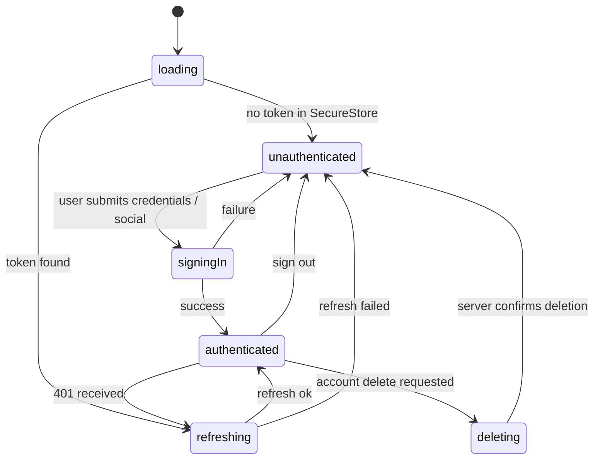

# The Weekly Fifty — Mobile App Architecture

**Version:** 1.0
**Date:** 2026-04-19
**Audience:** Tom (solo developer, building with Claude Code) and Claude Code itself
**Status:** Approved for Phase A scaffolding
**Owner of this document:** Architecture (handoff from PM Brief + Analyst Specification)

---

## How to use this document

This document is the single source of truth for *how* the Weekly Fifty mobile app is built. It pairs with two upstream documents you should keep open alongside it:

1. **PM Product Brief** — the *why* and *what* (user stories US-001..US-031, FRs, NFRs).
2. **Analyst Product Specification** — the formal *what* (acceptance criteria AC-001..AC-021, screen inventory, data model, integration spec).

This document is the *how*. Specifically:

- **For Tom:** read sections 1–4 and 21 (the Phased Build Plan) end-to-end before writing any code. The build plan tells you the order of work. Everything else is reference material consulted as you reach each phase.
- **For Claude Code:** when given a task, treat this document as the project's "constitution." Sections 4 (project structure), 5 (naming conventions), 8 (state management), 9 (API client), and 18 (Phase 2 hooks) define the conventions you must follow. Do not invent alternatives without explicit instruction from Tom.

**Convention used throughout:**

- **Decision** = a binding choice. Don't change without a written reason.
- **Assumption** = a stated belief about something we don't yet know. Tom should challenge it as facts emerge (most often: backend API shape).
- **Phase 2 hook** = a deliberate seam left in the code so a future feature (games, more content types, dynamic notification channels) can be added without a rewrite.

---

## Table of contents

1. [Executive architecture summary](#1-executive-architecture-summary)
2. [Architectural principles](#2-architectural-principles)
3. [Stack selection](#3-stack-selection)
4. [Project structure](#4-project-structure)
5. [Naming conventions and code style](#5-naming-conventions-and-code-style)
6. [Theming system](#6-theming-system)
7. [Navigation architecture](#7-navigation-architecture)
8. [State management](#8-state-management)
9. [API client pattern](#9-api-client-pattern)
10. [Auth architecture](#10-auth-architecture)
11. [RevenueCat integration](#11-revenuecat-integration)
12. [Push notifications](#12-push-notifications)
13. [Storage layer](#13-storage-layer)
14. [Analytics and error reporting](#14-analytics-and-error-reporting)
15. [Environment management](#15-environment-management)
16. [EAS Build setup](#16-eas-build-setup)
17. [App Store and Play Store submission](#17-app-store-and-play-store-submission)
18. [Phase 2 hooks](#18-phase-2-hooks)
19. [Testing strategy](#19-testing-strategy)
20. [CI/CD](#20-cicd)
21. [Phased build plan](#21-phased-build-plan-the-build-order)
22. [Risks and mitigations](#22-risks-and-mitigations)
23. [Open questions](#23-open-questions-tom-must-answer)
24. [Appendices](#24-appendices)

---

## 1. Executive architecture summary

The Weekly Fifty mobile app is an **Expo (managed) React Native** app that mirrors `theweeklyfifty.com.au` in functionality, brand, and voice. The stack is deliberately boring and convention-driven so that a solo developer working through Claude Code can ship a production-quality, store-compliant app with minimal yak-shaving.

The headline choices:

- **Expo SDK 52+ with the Managed Workflow + EAS Build.** No native code. No Xcode/Android Studio for day-to-day work. EAS handles builds, submissions, and OTA updates.
- **Expo Router (file-based, typed routes).** Conventional, web-like, and what Claude Code understands best.
- **TypeScript strict mode** everywhere.
- **TanStack Query** for server state. **Zustand** for client/UI state. No Redux. No global context soup.
- **A thin custom `apiClient`** wrapping `fetch`, with a single auth interceptor and a normalised error shape, so the existing Weekly Fifty REST API can be absorbed even while its exact shape is still being confirmed.
- **RevenueCat** as the single front door for paywalls, entitlements, and subscription state. The app never talks to App Store/Play Billing directly.
- **Firebase Cloud Messaging** for push, integrated via Expo's push API (which fronts FCM/APNs). Topics for content channels; one topic per content type to make Phase 2 expansion trivial.
- **expo-secure-store** for tokens. **MMKV** (via `react-native-mmkv`) for everything else.
- **Sentry** for error reporting. **PostHog** for product analytics (one tool, generous free tier, native RN SDK).
- **EAS Update** for OTA JS bumps; **GitHub Actions** wired to EAS CLI for CI/CD.
- **Theming:** a single `tokens.ts` ported from the website's CSS variables, exposed via a `ThemeProvider` and a `useTheme()` hook. Dark mode is **deferred to Phase 3** but the token shape supports it from day one.
- **Phase 2 readiness:** content is modelled as `{ contentType, contentId, ... }` from day one, entitlements are checked by capability not product, notification channels are a registry, and deep links route through a single resolver. None of this costs MVP velocity but all of it makes games + future content types a slot-in.

The whole app is designed so that a Claude Code session given a single clear instruction ("implement the Quiz screen per the spec") can produce code that fits the architecture without needing to ask architectural questions. That is the test of this document.

---

## 2. Architectural principles

These principles override personal preference. When in doubt, re-read.

1. **Boring beats clever.** Choose the most popular, most documented option. Claude Code is dramatically better at React Query than at the latest fashionable signal library.
2. **Managed over self-hosted.** RevenueCat over hand-rolled IAP. Sentry over self-hosted. Firebase over self-hosted push gateway. Tom's time is the bottleneck.
3. **Convention over configuration.** File-based routing. Folder-per-feature. One way to do common things.
4. **Strict TypeScript, narrow types, branded IDs.** Catch class-of-bug at compile time so the test budget can stay small.
5. **One state model per concern.** Server state lives in TanStack Query. UI state lives in Zustand. Nothing leaks.
6. **Errors normalise before they cross a boundary.** The API client returns `Result<T, ApiError>` (or throws a typed error consistently — see §9). Components never see raw `fetch` errors.
7. **Phase 2 hooks are real seams, not hand-waving.** Every "we'll add games later" claim has a corresponding line of code listed in §18.
8. **The web brand is the source of design truth.** All tokens come from the web; we don't get to invent a new look.
9. **Accessibility is non-optional.** Every interactive element gets an `accessibilityLabel` and `accessibilityRole`. WCAG AA contrast is checked at the token level.
10. **Privacy and store compliance are first-class features.** Account deletion (Apple §5.1.1(v)), data safety form, ATT prompt placement, and consent are designed in, not bolted on.

---

## 3. Stack selection

### 3.1 Core

| Concern | Choice | Version (target, 2026-04) | Rationale | Alternatives considered (and why rejected) |
| --- | --- | --- | --- | --- |
| Runtime | **Expo (managed)** | SDK 52+ | Solo dev + Claude Code synergy. EAS handles native builds. No Xcode/Android Studio for daily work. | **Bare React Native** — too much native plumbing for a solo dev. **Flutter** — separate ecosystem, fewer Claude Code priors, design system from web wouldn't port. **Capacitor/Ionic** — quiz UX deserves native feel, and push/IAP stories are weaker. |
| Language | **TypeScript** (strict) | 5.4+ | Catches integration bugs at compile time. Critical for solo + AI-assisted dev. | Plain JS — rejected outright. |
| Router | **Expo Router** | v4 (typed routes on) | File-based, typed routes, deep links + universal links built-in. The most documented Expo pattern. | **React Navigation directly** — works but is more boilerplate; Expo Router *is* React Navigation under the hood with a router on top. |

### 3.2 State and data

| Concern | Choice | Version | Rationale | Alternatives |
| --- | --- | --- | --- | --- |
| Server state / cache | **TanStack Query (React Query)** | v5 | Industry standard. Handles loading/error/refetch/optimistic. Pairs cleanly with our `apiClient`. | **SWR** — fine, smaller community on RN. **RTK Query** — drags in Redux. **Apollo** — REST not GraphQL. |
| Client / UI state | **Zustand** | v4 | Minimal. No provider tree. Slices per concern (auth UI, quiz session). Excellent TS. | **Redux Toolkit** — overkill for this scope. **Jotai/Recoil** — fine but Zustand is more conventional in the RN community now. **React Context only** — re-render hell at app scale. |
| Forms | **React Hook Form** + **Zod** | RHF 7, Zod 3 | RHF is the de-facto choice; Zod gives runtime validation that doubles as TS types. | Formik — older, slower. Plain controlled inputs — fine for tiny forms but we have multi-step paywall + auth + quiz settings. |
| Schema validation | **Zod** | v3 | Validate API responses at the boundary; types flow from schemas. | Yup — older. io-ts — clunky. |

### 3.3 Networking and platform services

| Concern | Choice | Version | Rationale | Alternatives |
| --- | --- | --- | --- | --- |
| HTTP | **`fetch`** (native) wrapped in `apiClient` | n/a | No reason for axios in 2026; `fetch` is fine and one less dep. | axios — habit, not a reason. ky — lighter axios; same comment. |
| Subscriptions / IAP | **RevenueCat** (`react-native-purchases` + paywalls UI) | latest | Receipt validation, entitlements, paywalls, A/B, webhooks. Replaces ~2 weeks of work and an entire class of bugs. | Hand-roll `react-native-iap` + server validation — high cost, low value. Glassfy/Adapty — viable; RevenueCat has the largest community + Expo support. |
| Push | **Expo Notifications** fronting **FCM** | latest | Expo's push service is the path of least resistance; uses FCM under the hood for Android and APNs for iOS. Single token model in JS. | Notifee — more capable, more setup. Pure FCM via `@react-native-firebase/messaging` — works but adds the whole RN Firebase suite when we only need messaging. **Decision:** start with Expo Notifications; if we hit a wall (rich notifications, custom sounds per channel), we add `expo-notifications` + Firebase config plugin. |
| Analytics | **PostHog** (`posthog-react-native`) | latest | Generous free tier, product analytics + feature flags + session replay (mobile). One tool, fewer SDKs. | Mixpanel/Amplitude — fine but more expensive at scale. Firebase Analytics — fine for events but we already use Firebase only for FCM and don't want to expand its surface area. |
| Crash / errors | **Sentry** (`sentry-expo` / `@sentry/react-native`) | latest | Best-in-class for RN, source maps via EAS, breadcrumbs, releases. | Bugsnag — comparable; Sentry's Expo integration is more documented. |
| Secure storage | **expo-secure-store** | latest | Keychain/Keystore-backed. For tokens only. | None worth considering. |
| KV storage | **react-native-mmkv** | v2 | 30x faster than AsyncStorage, synchronous, supports encryption. Used for cache, settings, lightweight persistence. | AsyncStorage — async-only, slow, JSON-stringified. **Decision:** MMKV everywhere except secrets. AsyncStorage **not** used as fallback (MMKV works on every platform we ship to). |
| Image caching | **expo-image** | latest | Built-in caching, blurhash placeholders, way better than `<Image>`. | FastImage — bare RN only. |

### 3.4 Tooling

| Concern | Choice | Rationale |
| --- | --- | --- |
| Package manager | **pnpm** | Fast, disk-efficient, strict. Works fine with EAS. |
| Linter | **ESLint** + **`eslint-config-expo`** + **`@typescript-eslint`** | Standard. |
| Formatter | **Prettier** | Standard. Single source of truth for style; ESLint defers to it. |
| Tests (unit) | **Jest** + **React Native Testing Library** | Standard. |
| Tests (E2E smoke) | **Maestro** | YAML-based, dramatically simpler than Detox for solo work. |
| Git hooks | **lefthook** | Faster + simpler than Husky. |
| Commit style | **Conventional Commits** | Enables automated changelogs later. |

### 3.5 What we explicitly are NOT using

- **Redux / Redux Toolkit** — Zustand + React Query covers it.
- **Tailwind/NativeWind** — adds a build step and a class-name dialect; our token system + StyleSheet is enough.
- **Reanimated 3 in MVP** — only pulled in when an animation actually demands it. Most can be done with the built-in `Animated` or `LayoutAnimation`.
- **Storybook** — solo dev, low ROI in MVP.
- **GraphQL** — backend is REST.
- **Detox** — Maestro is enough for our smoke flows.

---

## 4. Project structure

### 4.1 Day-1 skeleton

```
weekly-fifty/
├── app/                              // Expo Router routes — file-based
│   ├── _layout.tsx                   // Root layout: providers (Query, Theme, RevenueCat, Sentry)
│   ├── index.tsx                     // Splash/redirect → /home or /auth
│   ├── (auth)/                       // Auth group (no tab bar)
│   │   ├── _layout.tsx               // Stack navigator for auth flow
│   │   ├── sign-in.tsx
│   │   ├── sign-up.tsx
│   │   ├── forgot-password.tsx
│   │   └── verify-email.tsx
│   ├── (tabs)/                       // Main app (tab bar visible)
│   │   ├── _layout.tsx               // Tab navigator config
│   │   ├── home/
│   │   │   ├── index.tsx             // Home / This week's quiz
│   │   │   └── archive.tsx           // Past quizzes (Fifty+)
│   │   ├── games/
│   │   │   └── index.tsx             // Phase 2 placeholder; "Coming soon"
│   │   ├── shop/
│   │   │   └── index.tsx             // WebView wrapper around merch store
│   │   └── account/
│   │       ├── index.tsx             // Profile / settings landing
│   │       ├── subscription.tsx      // Manage Fifty+
│   │       ├── notifications.tsx     // Channel preferences
│   │       └── delete-account.tsx    // §5.1.1(v) compliance
│   ├── quiz/                         // Quiz player — modal-style, full screen
│   │   ├── _layout.tsx
│   │   ├── [quizId]/
│   │   │   ├── index.tsx             // Intro / start
│   │   │   ├── play.tsx              // Question runner
│   │   │   ├── results.tsx           // Score + leaderboard CTA
│   │   │   └── review.tsx            // Question-by-question review (Fifty+)
│   ├── paywall.tsx                   // RevenueCat paywall presented as modal
│   ├── notification/
│   │   └── [id].tsx                  // Deep-link landing page (resolves via deepLinkRouter)
│   └── +not-found.tsx
│
├── src/
│   ├── api/                          // API client + endpoint modules
│   │   ├── client.ts                 // Base apiClient (fetch wrapper)
│   │   ├── errors.ts                 // ApiError + normaliser
│   │   ├── interceptors.ts           // Auth + telemetry interceptors
│   │   ├── schemas/                  // Zod schemas per resource
│   │   │   ├── quiz.ts
│   │   │   ├── user.ts
│   │   │   └── subscription.ts
│   │   └── endpoints/                // One file per resource
│   │       ├── quiz.ts
│   │       ├── auth.ts
│   │       ├── user.ts
│   │       ├── leaderboard.ts
│   │       └── notifications.ts
│   │
│   ├── auth/
│   │   ├── AuthProvider.tsx          // Owns auth state machine
│   │   ├── useAuth.ts                // Hook surface
│   │   ├── tokenStore.ts             // expo-secure-store wrapper
│   │   ├── socialAuth.ts             // Apple + Google sign-in
│   │   └── machine.ts                // Pure state machine (no side effects)
│   │
│   ├── entitlements/
│   │   ├── RevenueCatProvider.tsx    // SDK init + identity sync
│   │   ├── useEntitlement.ts         // Capability-based gate (NOT product-based)
│   │   ├── capabilities.ts           // Capability registry (Phase 2 hook)
│   │   └── paywall.ts                // Helpers to present RC paywalls
│   │
│   ├── content/                      // Phase 2 hook: content-type abstraction
│   │   ├── types.ts                  // ContentItem<T>, ContentType union
│   │   ├── registry.ts               // Renderers registered by content type
│   │   └── adapters/                 // Per-type adapters
│   │       └── quiz.ts
│   │
│   ├── notifications/
│   │   ├── push.ts                   // Token registration + handlers
│   │   ├── channels.ts               // Channel registry (Phase 2 hook)
│   │   ├── deepLinkRouter.ts         // Single resolver for notification → route
│   │   └── usePermissions.ts         // Soft-ask flow
│   │
│   ├── analytics/
│   │   ├── posthog.ts                // Init + identify
│   │   ├── events.ts                 // Typed event taxonomy (matches Analyst's spec)
│   │   └── track.ts                  // Public API: track(event, props)
│   │
│   ├── theme/
│   │   ├── tokens.ts                 // Single source of truth
│   │   ├── ThemeProvider.tsx
│   │   ├── useTheme.ts
│   │   └── typography.ts             // Font family registration
│   │
│   ├── ui/                           // Shared primitives (no business logic)
│   │   ├── Button.tsx
│   │   ├── Text.tsx
│   │   ├── Screen.tsx                // SafeArea + scroll wrapper
│   │   ├── Card.tsx
│   │   ├── Spinner.tsx
│   │   ├── Modal.tsx
│   │   ├── EmptyState.tsx
│   │   └── ErrorState.tsx
│   │
│   ├── features/                     // Feature modules (UI + hooks + local state)
│   │   ├── quiz/
│   │   │   ├── components/
│   │   │   │   ├── QuestionCard.tsx
│   │   │   │   ├── AnswerInput.tsx
│   │   │   │   └── ScoreSummary.tsx
│   │   │   ├── hooks/
│   │   │   │   ├── useQuiz.ts
│   │   │   │   └── useQuizSession.ts
│   │   │   ├── store.ts              // Zustand slice for in-progress quiz
│   │   │   └── types.ts
│   │   ├── home/
│   │   ├── account/
│   │   └── paywall/
│   │
│   ├── lib/
│   │   ├── storage.ts                // MMKV wrapper
│   │   ├── secureStorage.ts          // SecureStore wrapper
│   │   ├── logger.ts                 // Sentry breadcrumbs + console
│   │   ├── result.ts                 // Result<T, E> helpers
│   │   ├── time.ts                   // Date utilities (Friday-relative)
│   │   └── env.ts                    // Typed env access
│   │
│   ├── config/
│   │   ├── constants.ts              // App-wide constants
│   │   ├── featureFlags.ts           // Wraps PostHog + RevenueCat flags
│   │   └── links.ts                  // External URLs (privacy, ToS, support)
│   │
│   └── types/
│       ├── api.ts                    // Shared API types
│       ├── domain.ts                 // Quiz, Question, User, Subscription
│       └── branded.ts                // QuizId, UserId, etc.
│
├── assets/
│   ├── fonts/
│   ├── images/
│   ├── icons/
│   └── splash/
│
├── tests/
│   ├── unit/                         // Mirrors src/ structure
│   ├── integration/                  // API client + auth + entitlement tests
│   └── e2e/
│       └── flows/                    // Maestro YAML
│
├── .github/
│   └── workflows/
│       ├── ci.yml                    // Lint + typecheck + unit on PR
│       └── eas-build.yml             // Build on tag
│
├── app.config.ts                     // Dynamic config (env-aware)
├── eas.json                          // Dev / preview / production profiles
├── babel.config.js
├── metro.config.js
├── tsconfig.json
├── .eslintrc.cjs
├── .prettierrc
├── lefthook.yml
├── package.json
├── pnpm-lock.yaml
├── README.md
└── .env.example                      // Documents required env vars
```

### 4.2 Why this layout

- **`app/` is routes only.** No business logic in route files; they compose features. A route file should usually be under 100 lines. If it grows, push logic into `src/features/<name>/`.
- **`src/features/` is feature modules.** Co-locate the hooks, components, and Zustand slice for a feature. Crossing feature boundaries (e.g., quiz importing from account) is a code smell — push the shared bit down to `src/ui/` or `src/lib/`.
- **`src/ui/` is dumb.** No data fetching. No API calls. No hooks beyond `useTheme()` / `useState()`. This makes them safe to recompose anywhere.
- **`src/api/` is the only place that talks to the network.** Components do not call `fetch`. They call hooks that wrap endpoint modules.
- **`src/content/`, `src/entitlements/capabilities.ts`, `src/notifications/channels.ts`** are the **Phase 2 seams** — see §18.
- **`src/lib/` is leaf utilities.** No imports from `features/` or `api/`.

### 4.3 Import boundaries (enforced)

```
ui  ← features  ← app
lib ← api ← features ← app
lib ← entitlements ← features ← app
lib ← notifications ← features ← app
lib ← auth ← features ← app
content ← features ← app
theme ← (everything UI)
```

**Rules:**
- `app/` may import anything from `src/`.
- `src/features/<x>/` may import from `src/ui/`, `src/lib/`, `src/api/`, `src/auth/`, `src/entitlements/`, `src/notifications/`, `src/theme/`, `src/content/`, `src/analytics/`, `src/types/`.
- `src/features/<x>/` may **not** import from `src/features/<y>/`. If two features need to share, the shared bit moves down to `src/ui/` or a new `src/domain/` module.
- `src/ui/` may import only from `src/theme/` and `src/lib/`.
- `src/lib/` may not import from anywhere except other `src/lib/` files.

Enforce with an ESLint rule (`eslint-plugin-import` `no-restricted-paths`). Configuration sketch:

```js
// .eslintrc.cjs (excerpt)
"import/no-restricted-paths": ["error", {
  zones: [
    { target: "src/ui", from: "src/features" },
    { target: "src/ui", from: "src/api" },
    { target: "src/lib", from: "src" }, // lib is leaf
    { target: "src/features/**", from: "src/features/**", except: ["./"] },
  ]
}]
```

---

## 5. Naming conventions and code style

### 5.1 File and folder names

| Kind | Convention | Example |
| --- | --- | --- |
| Route files (Expo Router) | `kebab-case.tsx` (Expo's convention) | `forgot-password.tsx` |
| React components | `PascalCase.tsx`, one component per file, default export named | `QuestionCard.tsx` |
| Hooks | `useThing.ts`, camelCase | `useEntitlement.ts` |
| Non-component modules | `camelCase.ts` | `tokenStore.ts` |
| Types-only modules | `camelCase.ts` (or `types.ts` co-located) | `domain.ts` |
| Zustand slices | `store.ts` co-located in feature folder | `features/quiz/store.ts` |
| Tests | `*.test.ts(x)` next to source OR mirrored in `tests/unit/` | `useEntitlement.test.ts` |
| Constants | `SCREAMING_SNAKE_CASE` exported from `config/constants.ts` | `QUIZ_QUESTION_LIMIT` |
| Env vars | `EXPO_PUBLIC_*` for client-readable; everything else server-only | `EXPO_PUBLIC_API_BASE_URL` |

### 5.2 Code style

- **TypeScript strict mode.** `"strict": true`, `"noUncheckedIndexedAccess": true`, `"exactOptionalPropertyTypes": true`. These three together stop ~80% of latent bugs.
- **No default exports for non-components.** Components default-export. Everything else uses named exports.
- **No `any`.** Use `unknown` and narrow. If you genuinely need `any`, write a comment explaining why and add a `// eslint-disable-next-line` so it stands out.
- **Branded IDs.** `type QuizId = string & { readonly __brand: "QuizId" }`. Prevents passing a `UserId` where a `QuizId` is expected.
- **Functions over classes.** Classes only when wrapping a stateful third-party SDK.
- **Arrow functions for components**, `function` for top-level utilities (better stack traces).
- **No barrel `index.ts` files** for re-exports. They confuse Metro and slow startup. Import from the file directly.
- **Imports ordered:** node/external → src absolute → relative. Enforced by `eslint-plugin-import`.
- **One concept per file.** If a file's name is `useQuiz.ts`, it exports `useQuiz` and possibly its types — nothing else.
- **Path alias:** `@/*` → `src/*`. Set in `tsconfig.json` and `babel.config.js`.

### 5.3 React/RN specifics

- **No inline styles for anything reusable.** Use `StyleSheet.create` at the bottom of the file, or `useStyles(theme)` if styles depend on theme.
- **Memoise expensive children.** `React.memo` for list items. `useCallback` for handlers passed into `FlatList`.
- **Use `FlashList` (from Shopify) for any list > 50 items.** For shorter lists, `FlatList` is fine.
- **`SafeAreaView` lives in `<Screen>` (the wrapper), not in every screen.**
- **Always set `accessibilityLabel` and `accessibilityRole`** on `Pressable`/`TouchableOpacity`. ESLint rule from `eslint-plugin-react-native-a11y` enforces this.

---

## 6. Theming system

### 6.1 Token shape

A single file (`src/theme/tokens.ts`) defines all design primitives. The shape is designed so that switching themes (light/dark, or even seasonal) is a value swap.

```ts
// src/theme/tokens.ts
export type ColorRole =
  | "background"
  | "surface"
  | "surfaceMuted"
  | "border"
  | "textPrimary"
  | "textSecondary"
  | "textInverse"
  | "brand"
  | "brandMuted"
  | "accent"
  | "success"
  | "warning"
  | "danger"
  | "overlay";

export type ThemeName = "light" | "dark";

export interface Theme {
  name: ThemeName;
  colors: Record<ColorRole, string>;
  typography: {
    fontFamily: { sans: string; serif: string; display: string; mono: string };
    size: { xs: number; sm: number; md: number; lg: number; xl: number; "2xl": number; "3xl": number; display: number };
    weight: { regular: "400"; medium: "500"; semibold: "600"; bold: "700" };
    lineHeight: { tight: number; normal: number; relaxed: number };
  };
  spacing: { 0: 0; 1: 4; 2: 8; 3: 12; 4: 16; 5: 20; 6: 24; 8: 32; 10: 40; 12: 48; 16: 64 };
  radii: { none: 0; sm: 4; md: 8; lg: 12; xl: 20; pill: 999 };
  shadows: {
    sm: { shadowColor: string; shadowOpacity: number; shadowRadius: number; shadowOffset: { width: number; height: number }; elevation: number };
    md: typeof Theme.prototype.shadows.sm;
    lg: typeof Theme.prototype.shadows.sm;
  };
  motion: {
    durations: { fast: 150; base: 250; slow: 400 };
    easings: { standard: "ease-in-out"; emphasized: "ease-out" };
  };
}

// Concrete tokens — populated from the Weekly Fifty website CSS variables.
// Tom: open theweeklyfifty.com.au DevTools → :root → copy the variable values.
// **Assumption:** the website exposes brand colours via CSS custom properties;
// if not, eyedropper from screenshots and confirm with James.

export const lightTheme: Theme = {
  name: "light",
  colors: {
    background: "#FFFFFF",
    surface: "#FFFFFF",
    surfaceMuted: "#F5F4F0",
    border: "#E5E1D8",
    textPrimary: "#111111",
    textSecondary: "#5C5A55",
    textInverse: "#FFFFFF",
    brand: "#0F4C3A",        // **Assumption:** Weekly Fifty deep green — confirm
    brandMuted: "#D6E5DE",
    accent: "#E0A92F",       // **Assumption:** gold accent — confirm
    success: "#2E7D32",
    warning: "#ED6C02",
    danger: "#C62828",
    overlay: "rgba(0,0,0,0.5)",
  },
  typography: {
    fontFamily: {
      sans: "Inter",         // **Assumption:** confirm with website
      serif: "Lora",
      display: "FrauncesDisplay",
      mono: "JetBrainsMono",
    },
    size: { xs: 12, sm: 14, md: 16, lg: 18, xl: 20, "2xl": 24, "3xl": 30, display: 40 },
    weight: { regular: "400", medium: "500", semibold: "600", bold: "700" },
    lineHeight: { tight: 1.15, normal: 1.4, relaxed: 1.6 },
  },
  spacing: { 0: 0, 1: 4, 2: 8, 3: 12, 4: 16, 5: 20, 6: 24, 8: 32, 10: 40, 12: 48, 16: 64 },
  radii: { none: 0, sm: 4, md: 8, lg: 12, xl: 20, pill: 999 },
  shadows: {
    sm: { shadowColor: "#000", shadowOpacity: 0.06, shadowRadius: 4, shadowOffset: { width: 0, height: 1 }, elevation: 1 },
    md: { shadowColor: "#000", shadowOpacity: 0.10, shadowRadius: 10, shadowOffset: { width: 0, height: 4 }, elevation: 4 },
    lg: { shadowColor: "#000", shadowOpacity: 0.16, shadowRadius: 24, shadowOffset: { width: 0, height: 8 }, elevation: 8 },
  },
  motion: {
    durations: { fast: 150, base: 250, slow: 400 },
    easings: { standard: "ease-in-out", emphasized: "ease-out" },
  },
};

export const darkTheme: Theme = {
  ...lightTheme,
  name: "dark",
  colors: {
    background: "#111111",
    surface: "#1B1B1A",
    surfaceMuted: "#232220",
    border: "#3A3936",
    textPrimary: "#F5F4F0",
    textSecondary: "#B8B4AB",
    textInverse: "#111111",
    brand: "#5FB392",
    brandMuted: "#1F3A30",
    accent: "#E0A92F",
    success: "#81C784",
    warning: "#FFB74D",
    danger: "#EF5350",
    overlay: "rgba(0,0,0,0.7)",
  },
};
```

### 6.2 Provider and hook

```tsx
// src/theme/ThemeProvider.tsx
import { createContext, useContext, useMemo } from "react";
import { useColorScheme } from "react-native";
import { lightTheme, darkTheme, type Theme } from "./tokens";

const ThemeContext = createContext<Theme>(lightTheme);

export function ThemeProvider({ children, override }: { children: React.ReactNode; override?: "light" | "dark" }) {
  const system = useColorScheme();
  const name = override ?? "light"; // **Decision:** dark mode deferred — see §6.3
  const theme = useMemo(() => (name === "dark" ? darkTheme : lightTheme), [name]);
  return <ThemeContext.Provider value={theme}>{children}</ThemeContext.Provider>;
}

export const useTheme = () => useContext(ThemeContext);
```

```tsx
// Usage pattern
const styles = useStyles((t) => ({
  card: { backgroundColor: t.colors.surface, padding: t.spacing[4], borderRadius: t.radii.md, ...t.shadows.sm },
  title: { color: t.colors.textPrimary, fontSize: t.typography.size.lg, fontFamily: t.typography.fontFamily.display },
}));
```

Where `useStyles` is a small helper:

```ts
// src/theme/useStyles.ts
import { useMemo } from "react";
import { StyleSheet } from "react-native";
import { useTheme } from "./ThemeProvider";
import type { Theme } from "./tokens";

export function useStyles<T extends StyleSheet.NamedStyles<T>>(factory: (t: Theme) => T): T {
  const t = useTheme();
  return useMemo(() => StyleSheet.create(factory(t)), [t, factory]);
}
```

### 6.3 Dark mode

- **Decision:** dark mode is **scaffolded** (token shape + `darkTheme` exist) but **not exposed** in MVP. The setting `appearance: "system" | "light" | "dark"` lives in `account/notifications.tsx` design slot but is hidden behind a feature flag for Phase 3.
- **Rationale:** dark mode QA effort is non-trivial (every screen, every state, every contrast check). Defer until usage warrants.
- **Cost of doing it later:** near-zero, because everything already routes through `useTheme()`.

### 6.4 Fonts

- Load via `expo-font` in the root layout. Use `useFonts()`.
- Self-hosted `.otf`/`.ttf` files in `assets/fonts/`. Don't rely on Google Fonts CDN.
- Fall-back stack defined per platform in `typography.ts` using `Platform.select`.

---

## 7. Navigation architecture

### 7.1 Structure (Expo Router file-based)

The route tree is shown in §4.1. The architectural points:

- **Root layout (`app/_layout.tsx`)** mounts all providers in this order (outermost first):
  1. `<SentryErrorBoundary>` (so crashes during init are reported)
  2. `<QueryClientProvider>`
  3. `<ThemeProvider>`
  4. `<RevenueCatProvider>` (depends on auth user id when logged in — see §11)
  5. `<AuthProvider>` (wraps everything that needs auth)
  6. `<PostHogProvider>`
  7. `<Stack>` (Expo Router's stack)

- **Auth group `(auth)`** is a separate stack with no tab bar. Visible only when `auth.status === "unauthenticated"`.
- **Main app `(tabs)`** is the four-tab layout: **Home, Games, Shop, Account**. (Games is a Phase 2 placeholder per the brief.)
- **Quiz** is a top-level route presented modally over tabs (full screen, immersive). Pushed via `router.push("/quiz/{id}")`.
- **Paywall** is a top-level route presented as `presentation: "modal"`.

### 7.2 Auth-gated navigation

Use Expo Router's `<Redirect>` in a guard layout:

```tsx
// app/(tabs)/_layout.tsx
import { Redirect, Tabs } from "expo-router";
import { useAuth } from "@/auth/useAuth";

export default function TabsLayout() {
  const { status } = useAuth();
  if (status === "loading") return null; // Splash already showing
  if (status === "unauthenticated") return <Redirect href="/(auth)/sign-in" />;
  return (
    <Tabs screenOptions={{ headerShown: false }}>
      <Tabs.Screen name="home" options={{ title: "This week" }} />
      <Tabs.Screen name="games" options={{ title: "Games" }} />
      <Tabs.Screen name="shop" options={{ title: "Shop" }} />
      <Tabs.Screen name="account" options={{ title: "Account" }} />
    </Tabs>
  );
}
```

Some content (e.g., the current week's quiz preview) is viewable without auth — those routes live outside `(tabs)` or short-circuit the redirect for guest mode. **Decision:** MVP requires sign-in to access *any* content, matching the website's behaviour. Confirm with James (open question OQ-3).

### 7.3 Deep links and universal links

- **URL scheme:** `weeklyfifty://` and HTTPS universal links on `theweeklyfifty.com.au`.
- **Configured in `app.config.ts`:**

```ts
scheme: "weeklyfifty",
ios: { associatedDomains: ["applinks:theweeklyfifty.com.au"] },
android: {
  intentFilters: [{
    action: "VIEW",
    data: [{ scheme: "https", host: "theweeklyfifty.com.au", pathPrefix: "/app" }],
    category: ["BROWSABLE", "DEFAULT"],
    autoVerify: true,
  }],
},
```

- **All inbound links route through `src/notifications/deepLinkRouter.ts`** (see §18.4) — *not* directly to a route. This is a Phase 2 hook so future content types can be added without touching navigation code.

### 7.4 Typed routes

Enable Expo Router typed routes:

```json
// app.json (expo plugins config)
"experiments": { "typedRoutes": true }
```

Then route refs become string-literal-typed:

```ts
router.push({ pathname: "/quiz/[quizId]/play", params: { quizId } });
```

---

## 8. State management

### 8.1 The split

| State kind | Lives in | Examples |
| --- | --- | --- |
| **Server state** (anything that came from or goes to the API) | TanStack Query | Current quiz, user profile, leaderboard, subscription status (cross-checked with RC), past quizzes |
| **Client/UI state** that persists across screens | Zustand | In-progress quiz answers (before submit), notification preference draft, paywall presentation state |
| **Component-local state** | `useState` | Toggle open/closed, input focus, scroll position |
| **Auth state** | Zustand slice owned by `AuthProvider` | `status`, `user`, `accessToken` (token in SecureStore — see §10) |
| **Entitlements** | Hook over RevenueCat SDK (`useEntitlement`) | `hasFiftyPlus`, `hasGamesAccess` (Phase 2) |
| **Theme** | React Context | Current theme tokens |

### 8.2 TanStack Query conventions

- **One QueryClient** at the root, configured with sensible defaults:

```ts
// src/api/queryClient.ts
export const queryClient = new QueryClient({
  defaultOptions: {
    queries: {
      staleTime: 30_000,
      gcTime: 5 * 60_000,
      retry: (failureCount, err) => {
        if (err instanceof ApiError && [401, 403, 404].includes(err.status)) return false;
        return failureCount < 2;
      },
      refetchOnWindowFocus: false, // RN doesn't have windows; rely on app focus event we wire ourselves
    },
    mutations: { retry: false },
  },
});
```

- **Query keys** are arrays starting with the resource: `["quiz", quizId]`, `["quiz", "current"]`, `["leaderboard", quizId]`. Centralise in `src/api/keys.ts`:

```ts
// src/api/keys.ts
export const qk = {
  quiz: {
    all: ["quiz"] as const,
    current: () => [...qk.quiz.all, "current"] as const,
    byId: (id: QuizId) => [...qk.quiz.all, id] as const,
    archive: (filters?: ArchiveFilters) => [...qk.quiz.all, "archive", filters ?? {}] as const,
  },
  user: {
    me: () => ["user", "me"] as const,
  },
  leaderboard: {
    forQuiz: (id: QuizId) => ["leaderboard", id] as const,
  },
} as const;
```

- **Custom hooks per query**, in the feature folder:

```ts
// src/features/quiz/hooks/useCurrentQuiz.ts
export function useCurrentQuiz() {
  return useQuery({
    queryKey: qk.quiz.current(),
    queryFn: () => quizApi.getCurrent(),
  });
}
```

- **Mutations** invalidate explicitly:

```ts
export function useSubmitQuiz() {
  const qc = useQueryClient();
  return useMutation({
    mutationFn: quizApi.submit,
    onSuccess: (_data, vars) => {
      qc.invalidateQueries({ queryKey: qk.quiz.byId(vars.quizId) });
      qc.invalidateQueries({ queryKey: qk.leaderboard.forQuiz(vars.quizId) });
    },
  });
}
```

- **Optimistic updates** only where they pay off (e.g., toggling notification channel). Default is "wait for server."

### 8.3 Zustand conventions

- **One slice per feature.** Don't make a global mega-store.
- **Persist sparingly.** Use `zustand/middleware` `persist` with our MMKV adapter only for things that should survive force-quit (in-progress quiz answers).

```ts
// src/features/quiz/store.ts
import { create } from "zustand";
import { persist } from "zustand/middleware";
import { mmkvStorage } from "@/lib/storage";
import type { QuestionId, QuizId } from "@/types/branded";

interface QuizSessionState {
  quizId: QuizId | null;
  answers: Record<QuestionId, string>;
  startedAt: number | null;
  currentIndex: number;
  setAnswer: (q: QuestionId, a: string) => void;
  next: () => void;
  prev: () => void;
  reset: () => void;
  start: (id: QuizId) => void;
}

export const useQuizSession = create<QuizSessionState>()(
  persist(
    (set) => ({
      quizId: null,
      answers: {},
      startedAt: null,
      currentIndex: 0,
      start: (id) => set({ quizId: id, answers: {}, startedAt: Date.now(), currentIndex: 0 }),
      setAnswer: (q, a) => set((s) => ({ answers: { ...s.answers, [q]: a } })),
      next: () => set((s) => ({ currentIndex: s.currentIndex + 1 })),
      prev: () => set((s) => ({ currentIndex: Math.max(0, s.currentIndex - 1) })),
      reset: () => set({ quizId: null, answers: {}, startedAt: null, currentIndex: 0 }),
    }),
    { name: "quiz-session", storage: mmkvStorage }
  )
);
```

### 8.4 What to avoid

- **No React Context for server data.** Always TanStack Query.
- **No Zustand for server data.** It will go stale.
- **No global event bus.** Use Query invalidation or Zustand subscriptions.

---

## 9. API client pattern

The Weekly Fifty backend's exact REST shape is **not yet confirmed** (open question OQ-1). The pattern below is designed so that absorbing the actual shape is mechanical:

- All response parsing is centralised in **Zod schemas** (`src/api/schemas/`). When Tom learns the real shape, he updates the schemas; nothing else needs to change.
- All endpoints are pure functions in **endpoint modules** (`src/api/endpoints/`). They take typed inputs and return parsed outputs.
- Authentication, error normalisation, retry, and telemetry happen in **interceptors** (`src/api/interceptors.ts`) — never in the endpoint files.

### 9.1 Base client

```ts
// src/api/client.ts
import { ApiError, normalizeError } from "./errors";
import { addAuthHeader, refreshOn401 } from "./interceptors";
import { env } from "@/lib/env";
import { logger } from "@/lib/logger";
import type { ZodSchema } from "zod";

interface RequestOptions<T> {
  method?: "GET" | "POST" | "PUT" | "PATCH" | "DELETE";
  path: string;
  query?: Record<string, string | number | boolean | undefined>;
  body?: unknown;
  schema: ZodSchema<T>;        // **Required**: forces parsing at the boundary
  signal?: AbortSignal;
  authenticated?: boolean;     // default true; auth endpoints set false
  timeoutMs?: number;          // default 15000
}

const BASE = env.EXPO_PUBLIC_API_BASE_URL;

export async function apiRequest<T>(opts: RequestOptions<T>): Promise<T> {
  const { method = "GET", path, query, body, schema, signal, authenticated = true, timeoutMs = 15_000 } = opts;
  const url = new URL(path.replace(/^\//, ""), BASE.endsWith("/") ? BASE : BASE + "/");
  if (query) for (const [k, v] of Object.entries(query)) if (v !== undefined) url.searchParams.set(k, String(v));

  const controller = new AbortController();
  const timeout = setTimeout(() => controller.abort(new DOMException("timeout", "AbortError")), timeoutMs);
  if (signal) signal.addEventListener("abort", () => controller.abort(signal.reason));

  const headers: Record<string, string> = { "Content-Type": "application/json", "Accept": "application/json" };
  if (authenticated) await addAuthHeader(headers);

  const t0 = Date.now();
  try {
    const res = await fetch(url.toString(), {
      method,
      headers,
      body: body !== undefined ? JSON.stringify(body) : undefined,
      signal: controller.signal,
    });
    logger.breadcrumb({ category: "http", message: `${method} ${path} ${res.status} ${Date.now() - t0}ms` });

    if (res.status === 401 && authenticated) {
      const retried = await refreshOn401(opts);
      if (retried) return retried as T;
    }
    if (!res.ok) throw await ApiError.fromResponse(res);

    if (res.status === 204) return undefined as T;
    const json = await res.json();
    const parsed = schema.safeParse(json);
    if (!parsed.success) {
      logger.error("api.parse_failed", { path, issues: parsed.error.issues });
      throw new ApiError({ status: 0, code: "PARSE_ERROR", message: "Unexpected API response shape", cause: parsed.error });
    }
    return parsed.data;
  } catch (err) {
    throw normalizeError(err);
  } finally {
    clearTimeout(timeout);
  }
}
```

### 9.2 Error model

```ts
// src/api/errors.ts
export type ApiErrorCode =
  | "NETWORK"
  | "TIMEOUT"
  | "UNAUTHORIZED"
  | "FORBIDDEN"
  | "NOT_FOUND"
  | "CONFLICT"
  | "RATE_LIMITED"
  | "SERVER"
  | "PARSE_ERROR"
  | "UNKNOWN";

export class ApiError extends Error {
  readonly status: number;
  readonly code: ApiErrorCode;
  readonly details?: unknown;
  constructor(args: { status: number; code: ApiErrorCode; message: string; details?: unknown; cause?: unknown }) {
    super(args.message, { cause: args.cause });
    this.status = args.status;
    this.code = args.code;
    this.details = args.details;
    this.name = "ApiError";
  }
  static async fromResponse(res: Response): Promise<ApiError> {
    let body: unknown;
    try { body = await res.json(); } catch { body = undefined; }
    const code: ApiErrorCode =
      res.status === 401 ? "UNAUTHORIZED" :
      res.status === 403 ? "FORBIDDEN" :
      res.status === 404 ? "NOT_FOUND" :
      res.status === 409 ? "CONFLICT" :
      res.status === 429 ? "RATE_LIMITED" :
      res.status >= 500 ? "SERVER" : "UNKNOWN";
    const message = (body && typeof body === "object" && "message" in body && typeof (body as any).message === "string")
      ? (body as any).message
      : `HTTP ${res.status}`;
    return new ApiError({ status: res.status, code, message, details: body });
  }
}

export function normalizeError(err: unknown): ApiError {
  if (err instanceof ApiError) return err;
  if (err instanceof DOMException && err.name === "AbortError") {
    return new ApiError({ status: 0, code: "TIMEOUT", message: "Request timed out", cause: err });
  }
  if (err instanceof TypeError) {
    return new ApiError({ status: 0, code: "NETWORK", message: "Network unavailable", cause: err });
  }
  return new ApiError({ status: 0, code: "UNKNOWN", message: "Unknown error", cause: err });
}
```

### 9.3 Worked example: the quiz endpoint module

```ts
// src/api/schemas/quiz.ts
import { z } from "zod";

export const QuestionSchema = z.object({
  id: z.string(),
  index: z.number().int(),
  prompt: z.string(),
  category: z.string().optional(),
  // **Assumption:** answers come server-side and aren't returned until submission.
  // If the website already returns them, switch to z.string() and add to type.
  imageUrl: z.string().url().optional(),
});

export const QuizSchema = z.object({
  id: z.string(),
  weekOf: z.string(),                           // ISO date of that Friday
  publishedAt: z.string(),
  title: z.string(),
  questions: z.array(QuestionSchema).length(50),
  status: z.enum(["draft", "live", "closed"]),
  isFiftyPlusOnly: z.boolean().default(false),
});
export type Quiz = z.infer<typeof QuizSchema>;

export const QuizSubmissionResultSchema = z.object({
  score: z.number().int(),
  outOf: z.number().int(),
  rank: z.number().int().nullable(),
  perQuestion: z.array(z.object({
    questionId: z.string(),
    correct: z.boolean(),
    correctAnswer: z.string(),
    userAnswer: z.string().nullable(),
  })),
});
export type QuizSubmissionResult = z.infer<typeof QuizSubmissionResultSchema>;
```

```ts
// src/api/endpoints/quiz.ts
import { apiRequest } from "../client";
import { QuizSchema, QuizSubmissionResultSchema, type Quiz, type QuizSubmissionResult } from "../schemas/quiz";
import type { QuizId } from "@/types/branded";
import { z } from "zod";

export const quizApi = {
  getCurrent: () =>
    apiRequest({ method: "GET", path: "/quizzes/current", schema: QuizSchema }),

  getById: (id: QuizId) =>
    apiRequest({ method: "GET", path: `/quizzes/${id}`, schema: QuizSchema }),

  listArchive: (params?: { page?: number; year?: number }) =>
    apiRequest({
      method: "GET",
      path: "/quizzes",
      query: params,
      schema: z.object({
        items: z.array(QuizSchema.pick({ id: true, weekOf: true, title: true, isFiftyPlusOnly: true })),
        page: z.number(),
        totalPages: z.number(),
      }),
    }),

  submit: (input: { quizId: QuizId; answers: Record<string, string> }) =>
    apiRequest({
      method: "POST",
      path: `/quizzes/${input.quizId}/submit`,
      body: { answers: input.answers },
      schema: QuizSubmissionResultSchema,
    }),
};
```

### 9.4 Absorbing backend deltas

When the real backend shape differs from these schemas:

1. Update the Zod schema in `src/api/schemas/<resource>.ts`.
2. Update the endpoint signature in `src/api/endpoints/<resource>.ts`.
3. TypeScript will surface every dependent breakage. Fix until it compiles.
4. Re-run unit tests on the API layer.

This pattern means we can start coding *now* against assumed schemas and tighten as the real API is documented.

---

## 10. Auth architecture

### 10.1 State machine



States:
- `loading` — splash; we're checking SecureStore.
- `unauthenticated` — no valid session; show `(auth)` stack.
- `signingIn` — credential exchange in flight.
- `refreshing` — exchanging refresh token for a new access token.
- `authenticated` — have valid access token + user profile.
- `deleting` — account deletion in flight.

### 10.2 Implementation

```ts
// src/auth/machine.ts (pure)
export type AuthState =
  | { status: "loading" }
  | { status: "unauthenticated"; lastError?: string }
  | { status: "signingIn"; method: "password" | "apple" | "google" }
  | { status: "refreshing"; user?: User }
  | { status: "authenticated"; user: User; accessTokenExpiresAt: number }
  | { status: "deleting"; user: User };

export type AuthEvent =
  | { type: "boot"; hasToken: boolean }
  | { type: "signInRequested"; method: "password" | "apple" | "google" }
  | { type: "signInSucceeded"; user: User; expiresAt: number }
  | { type: "signInFailed"; error: string }
  | { type: "tokenExpired" }
  | { type: "refreshSucceeded"; user: User; expiresAt: number }
  | { type: "refreshFailed" }
  | { type: "signOutRequested" }
  | { type: "deleteRequested" }
  | { type: "deleteConfirmed" };
```

The reducer is a single switch; tests cover each transition (high ROI).

### 10.3 Token storage

- **Access token + refresh token** → `expo-secure-store` (Keychain on iOS, Keystore on Android).
- **User profile (non-sensitive)** → MMKV cache for instant boot, but always re-fetched as a TanStack Query in the background.

```ts
// src/auth/tokenStore.ts
import * as SecureStore from "expo-secure-store";

const KEY_ACCESS = "wf.accessToken";
const KEY_REFRESH = "wf.refreshToken";
const OPTS = { keychainAccessible: SecureStore.WHEN_UNLOCKED } as const;

export const tokenStore = {
  async save(access: string, refresh: string) {
    await SecureStore.setItemAsync(KEY_ACCESS, access, OPTS);
    await SecureStore.setItemAsync(KEY_REFRESH, refresh, OPTS);
  },
  async load() {
    const access = await SecureStore.getItemAsync(KEY_ACCESS);
    const refresh = await SecureStore.getItemAsync(KEY_REFRESH);
    return access && refresh ? { access, refresh } : null;
  },
  async clear() {
    await SecureStore.deleteItemAsync(KEY_ACCESS);
    await SecureStore.deleteItemAsync(KEY_REFRESH);
  },
};
```

### 10.4 Refresh handling

- `apiClient` interceptor catches 401 once per request, calls the refresh endpoint, retries the original request.
- A **single in-flight refresh promise** prevents stampede if many requests 401 simultaneously.
- If refresh fails → clear tokens, transition to `unauthenticated`, navigate to `/sign-in` with toast.

```ts
// src/api/interceptors.ts (sketch)
let inflightRefresh: Promise<boolean> | null = null;

export async function refreshOn401<T>(opts: RequestOptions<T>): Promise<T | null> {
  if (!inflightRefresh) inflightRefresh = doRefresh().finally(() => { inflightRefresh = null; });
  const ok = await inflightRefresh;
  if (!ok) return null;
  // re-issue original request once
  return apiRequest({ ...opts, /* mark as no-retry */ });
}
```

### 10.5 Social auth

- **Sign in with Apple** is **mandatory on iOS** if any other social provider is offered (App Store Guideline 4.8). Use `expo-apple-authentication`.
- **Google sign-in** via `expo-auth-session` with the Google provider config. Tom registers OAuth client IDs in Google Cloud Console.
- Both flows produce an identity token (Apple) or an authorization code (Google) that we POST to our backend's `/auth/social` endpoint, which mints our own session tokens. The app never sees Apple/Google tokens beyond that exchange.

### 10.6 Logout and account deletion

- **Logout:** clear SecureStore, call `/auth/logout` (best-effort), clear Query cache, transition to `unauthenticated`, RevenueCat `logOut()`, PostHog `reset()`.
- **Account deletion (US-024, AC-014, App Store §5.1.1(v)):**
  - In `account/delete-account.tsx`, present a confirmation screen explaining what is deleted (account, profile, history, subscription cancellation note).
  - On confirm, call `DELETE /users/me`. Backend handles cascade.
  - On success, RevenueCat `logOut()` (note: RC does **not** delete the customer, just disassociates), Firebase token unregister, then transition to `unauthenticated`.
  - Show a final confirmation ("Your account has been deleted") and route to sign-in.

---

## 11. RevenueCat integration

### 11.1 Why RevenueCat

The brief sets it as a default. To restate the value: RC owns receipt validation, entitlement state across devices, the paywall UI, A/B tests, intro offers, and webhooks to our backend. Without it we'd be writing receipt validation against Apple's S2S API and reconciling against Google's Real-Time Developer Notifications. That's weeks of work and an entire bug surface.

### 11.2 Configuration

- Two RC projects: **dev** (TestFlight/internal) and **production** (App Store/Play). Two API keys — kept in EAS secrets (see §15).
- One **entitlement**: `fifty_plus`.
- Two **products** initially:
  - `fifty_plus_monthly`
  - `fifty_plus_annual`
- One **offering**: `default` containing both products.
- **Phase 2 hook:** when games launch with à-la-carte, add an entitlement `games_access` and a separate offering — the `useEntitlement(capability)` hook below makes this transparent to most code.

### 11.3 Initialization

```tsx
// src/entitlements/RevenueCatProvider.tsx
import Purchases, { LOG_LEVEL } from "react-native-purchases";
import { useEffect } from "react";
import { Platform } from "react-native";
import { env } from "@/lib/env";
import { useAuth } from "@/auth/useAuth";

let configured = false;

export function RevenueCatProvider({ children }: { children: React.ReactNode }) {
  const { status, user } = useAuth();

  useEffect(() => {
    if (configured) return;
    Purchases.setLogLevel(__DEV__ ? LOG_LEVEL.DEBUG : LOG_LEVEL.WARN);
    Purchases.configure({
      apiKey: Platform.OS === "ios" ? env.RC_API_KEY_IOS : env.RC_API_KEY_ANDROID,
      // We identify on auth instead of using anonymous ids long-term
    });
    configured = true;
  }, []);

  useEffect(() => {
    if (status === "authenticated" && user) {
      Purchases.logIn(user.id).catch(() => {/* RC handles offline */});
    } else if (status === "unauthenticated") {
      Purchases.logOut().catch(() => {});
    }
  }, [status, user?.id]);

  return <>{children}</>;
}
```

### 11.4 The `useEntitlement` hook (capability-based)

This is a **Phase 2 hook**: instead of asking "does the user have product X?", the app asks "does the user have capability Y?". A capability registry maps capability → entitlement(s).

```ts
// src/entitlements/capabilities.ts
export type Capability = "fiftyPlusContent" | "downloadablePdf" | "gamesAccess" /* Phase 2 */;

const ENTITLEMENT_FOR: Record<Capability, string[]> = {
  fiftyPlusContent: ["fifty_plus"],
  downloadablePdf: ["fifty_plus"],
  gamesAccess: ["games_access"], // Phase 2; entitlement does not exist yet — that's fine
};

export function entitlementsFor(capability: Capability): string[] {
  return ENTITLEMENT_FOR[capability] ?? [];
}
```

```ts
// src/entitlements/useEntitlement.ts
import { useEffect, useState } from "react";
import Purchases, { type CustomerInfo } from "react-native-purchases";
import { entitlementsFor, type Capability } from "./capabilities";

export function useEntitlement(capability: Capability): {
  active: boolean;
  loading: boolean;
  refresh: () => Promise<void>;
} {
  const [info, setInfo] = useState<CustomerInfo | null>(null);
  const [loading, setLoading] = useState(true);

  const refresh = async () => {
    try {
      const ci = await Purchases.getCustomerInfo();
      setInfo(ci);
    } finally {
      setLoading(false);
    }
  };

  useEffect(() => {
    refresh();
    const sub = Purchases.addCustomerInfoUpdateListener(setInfo);
    return () => { sub.remove?.(); };
  }, []);

  const required = entitlementsFor(capability);
  const active = !!info && required.some((e) => !!info.entitlements.active[e]);
  return { active, loading, refresh };
}
```

Usage:

```tsx
const { active: canAccessFiftyPlus, loading } = useEntitlement("fiftyPlusContent");
if (loading) return <Spinner />;
if (!canAccessFiftyPlus) return <PaywallCTA capability="fiftyPlusContent" />;
return <ArchiveList />;
```

### 11.5 Paywall presentation

Use **RevenueCat's hosted paywall UI** (`react-native-purchases-ui`). It's customisable, A/B-test-ready, and updates without an app release.

```tsx
// src/entitlements/paywall.ts
import RevenueCatUI, { PAYWALL_RESULT } from "react-native-purchases-ui";

export async function presentPaywall(opts?: { offeringIdentifier?: string }) {
  const result = await RevenueCatUI.presentPaywall({
    offering: opts?.offeringIdentifier ? { identifier: opts.offeringIdentifier } : undefined,
  });
  return result === PAYWALL_RESULT.PURCHASED || result === PAYWALL_RESULT.RESTORED;
}
```

Hard paywalls (e.g., `paywall.tsx` route) can use `presentPaywallIfNeeded` keyed on `requiredEntitlementIdentifier`.

### 11.6 Restore purchases

Mandatory by App Store rules — a "Restore" button on the Subscription screen and the paywall:

```ts
await Purchases.restorePurchases();
// CustomerInfo update listener will refresh entitlements automatically
```

### 11.7 Server webhook expectations

Backend should accept RevenueCat webhooks at e.g. `POST /webhooks/revenuecat` to keep its own `users.is_fifty_plus` mirror in sync. Verify the `Authorization` header against a shared secret. **Open question for backend team (OQ-7):** confirm endpoint exists and what it does on `EXPIRATION`, `BILLING_ISSUE`, `CANCELLATION` events.

The mobile app **does not** rely on the backend's mirror for gating — it reads RC directly via `useEntitlement` for instant accuracy. The backend mirror is for server-side features (e.g., serving Fifty+-only quiz archives via API).

---

## 12. Push notifications

### 12.1 The chain

```
App → Expo Notifications SDK → Expo push service → APNs (iOS) / FCM (Android) → Device
```

We use Expo's push service even though FCM is in the stack — Expo's service fronts both APNs and FCM, gives us a single token model (`ExponentPushToken[xxx]`), and removes the need for a Firebase config plugin in MVP.

**Caveat:** if we later need rich notifications, custom sounds per channel, or notification extensions, switch to direct FCM/APNs via `expo-notifications` + `@react-native-firebase/messaging`. Listed as a Phase 3 risk.

### 12.2 Token lifecycle

```ts
// src/notifications/push.ts
import * as Notifications from "expo-notifications";
import { Platform } from "react-native";
import Constants from "expo-constants";
import { notificationsApi } from "@/api/endpoints/notifications";
import { logger } from "@/lib/logger";

Notifications.setNotificationHandler({
  handleNotification: async () => ({
    shouldShowAlert: true, shouldPlaySound: false, shouldSetBadge: false,
  }),
});

export async function registerForPush(userId: string): Promise<string | null> {
  if (Platform.OS === "android") {
    await Notifications.setNotificationChannelAsync("default", {
      name: "Default",
      importance: Notifications.AndroidImportance.DEFAULT,
    });
    await Notifications.setNotificationChannelAsync("weekly_quiz", {
      name: "Weekly Quiz",
      importance: Notifications.AndroidImportance.HIGH,
      sound: "default",
    });
    // Phase 2 hook: channels created lazily from src/notifications/channels.ts registry
  }

  const settings = await Notifications.getPermissionsAsync();
  if (settings.status !== "granted") return null; // soft-ask flow handles request

  const token = (await Notifications.getExpoPushTokenAsync({
    projectId: Constants.expoConfig?.extra?.eas?.projectId,
  })).data;

  try {
    await notificationsApi.registerToken({ userId, token, platform: Platform.OS });
  } catch (e) {
    logger.error("push.register_failed", e);
  }
  return token;
}
```

### 12.3 Permission soft-ask

- **Never prompt at app launch.** Apple guidelines and basic UX.
- Show a **soft prompt** (in-app explainer) on these triggers:
  - User completes their first quiz → "Want a reminder when next Friday's quiz drops?"
  - User toggles a notification channel ON in `account/notifications.tsx` and we don't yet have permission.
- Only after the user accepts the soft prompt do we call `Notifications.requestPermissionsAsync()`.
- If denied a second time (system flag), the toggle UI deep-links to OS settings via `Linking.openSettings()`.

### 12.4 Foreground / background handlers

- **Foreground:** the `setNotificationHandler` above shows the banner. We also `track("notification_received", { ... })`.
- **Background tap:** Expo invokes our notification response listener. Pass through the deep-link router (§18.4):

```ts
Notifications.addNotificationResponseReceivedListener((response) => {
  const data = response.notification.request.content.data as NotificationPayload;
  deepLinkRouter.handle(data);
});
```

### 12.5 Channel preference sync

User notification preferences (`weekly_quiz`, `fifty_plus_drop`, `merch`, future channels) are stored server-side. On change:

1. Optimistically update Zustand draft state.
2. Mutate `PATCH /users/me/notification-preferences`.
3. On Android, the channel is enabled/disabled at the OS level; on iOS, the topic subscription is the only lever (we don't manage iOS notification categories per channel in MVP).

The **channel registry** (`src/notifications/channels.ts`) is the Phase 2 hook — see §18.3.

---

## 13. Storage layer

### 13.1 Three tiers

| Tier | Tool | Use for |
| --- | --- | --- |
| **Secure** | `expo-secure-store` | Access token, refresh token, anything PII-sensitive |
| **Persistent KV** | `react-native-mmkv` | App settings, in-progress quiz draft, cached profile, last seen quiz id |
| **In-memory** | TanStack Query cache | Server data |

**Decision:** MMKV is used everywhere except secrets. AsyncStorage is **not** included. Rationale: MMKV is supported on every platform we ship (iOS, Android, no web target), is faster, synchronous, and supports encryption keys. No fallback needed.

### 13.2 Wrappers

```ts
// src/lib/storage.ts
import { MMKV } from "react-native-mmkv";

const mmkv = new MMKV({ id: "wf.default" });

export const storage = {
  get<T = unknown>(key: string): T | null {
    const raw = mmkv.getString(key);
    if (!raw) return null;
    try { return JSON.parse(raw) as T; } catch { return null; }
  },
  set(key: string, value: unknown): void {
    mmkv.set(key, JSON.stringify(value));
  },
  delete(key: string): void { mmkv.delete(key); },
  clear(): void { mmkv.clearAll(); },
};

// Zustand persist adapter
export const mmkvStorage = {
  getItem: (name: string) => mmkv.getString(name) ?? null,
  setItem: (name: string, value: string) => mmkv.set(name, value),
  removeItem: (name: string) => mmkv.delete(name),
};
```

### 13.3 Cache strategy

- **TanStack Query** is the cache for everything fetched. `gcTime` = 5 min default, longer for slow-changing data (`quiz.byId` = 24h).
- **Persisted Query cache:** use `@tanstack/query-async-storage-persister` with our MMKV adapter so cached data survives cold starts. **Decision:** enable for `quiz.current` and `user.me` only — these power the offline-friendly first paint.
- **Image cache:** `expo-image` handles its own disk + memory cache.

---

## 14. Analytics and error reporting

### 14.1 Picks

- **Analytics: PostHog** (`posthog-react-native`).
  - Why: free tier covers our scale, single tool gives us product analytics + feature flags + (optional) session replay, native RN SDK with autocapture turned off for privacy.
  - Alternatives rejected: Mixpanel (cost), Amplitude (cost), Firebase Analytics (we don't want to expand Firebase footprint).
- **Errors: Sentry** (`@sentry/react-native` via `sentry-expo` config plugin).
  - Why: best RN integration, source maps via EAS hook, release tracking, performance traces.

### 14.2 Sentry setup

```ts
// Sentry.init in app/_layout.tsx (top of file, before other imports execute side effects)
import * as Sentry from "@sentry/react-native";
import Constants from "expo-constants";

Sentry.init({
  dsn: process.env.EXPO_PUBLIC_SENTRY_DSN,
  enabled: !__DEV__,
  environment: Constants.expoConfig?.extra?.env ?? "production",
  release: Constants.expoConfig?.version,
  tracesSampleRate: 0.1,
  beforeSend(event) {
    // PII scrub — see §14.4
    return scrubPii(event);
  },
});
```

Wrap the root with `Sentry.wrap(RootLayout)` for navigation breadcrumbs.

### 14.3 Event taxonomy (matches Analyst's spec)

Centralise events in `src/analytics/events.ts`:

```ts
// src/analytics/events.ts
export const Events = {
  AppOpened: "app_opened",
  SignInStarted: "sign_in_started",
  SignInSucceeded: "sign_in_succeeded",
  SignInFailed: "sign_in_failed",
  QuizStarted: "quiz_started",
  QuizQuestionAnswered: "quiz_question_answered",
  QuizSubmitted: "quiz_submitted",
  PaywallShown: "paywall_shown",
  PaywallPurchased: "paywall_purchased",
  PaywallDismissed: "paywall_dismissed",
  NotificationPermissionAsked: "notification_permission_asked",
  NotificationOpened: "notification_opened",
  AccountDeleted: "account_deleted",
  // ...mirror the Analyst's full taxonomy
} as const;

export type EventName = typeof Events[keyof typeof Events];

export interface EventProps {
  [Events.QuizSubmitted]: { quizId: string; score: number; durationMs: number };
  [Events.PaywallShown]: { source: "archive" | "review" | "settings" | "deeplink"; offeringId: string };
  [Events.PaywallPurchased]: { productId: string; price?: number; currency?: string };
  // Add as needed; missing entries default to {}
}
```

```ts
// src/analytics/track.ts
import { posthog } from "./posthog";
import type { EventName, EventProps } from "./events";

export function track<E extends EventName>(name: E, props?: E extends keyof EventProps ? EventProps[E] : Record<string, unknown>): void {
  posthog.capture(name, props as Record<string, unknown> | undefined);
}
```

### 14.4 PII scrubbing

- Never include **email, phone, full name, address** in event properties or Sentry breadcrumbs. Use `userId` (opaque) only.
- `beforeSend` in Sentry strips known PII keys from `request`, `extra`, `breadcrumbs`.
- PostHog: `defaultOptIn: true` only after the user has accepted analytics in onboarding (open question OQ-9 — confirm AU/EU consent posture).

---

## 15. Environment management

### 15.1 The problem

We have three runtime targets (dev local, staging build, production), each with its own API base URL, RC API keys, Sentry DSN, Firebase config, Apple/Google client ids. Plus EAS Build needs to inject these at build time.

### 15.2 The plan

- **`.env` files** for local development (`.env.development`, `.env.staging`, `.env.production`). Load via `babel-plugin-transform-inline-environment-variables` (already standard with Expo).
- **`app.config.ts`** (replaces `app.json`) reads environment variables and produces the right config for the current target.
- **EAS Build secrets** for anything that must not be in git (RC API keys, Sentry DSN, Apple/Google client ids). Set via `eas secret:create`.
- **Public vs private:** anything readable by the JS bundle must be prefixed `EXPO_PUBLIC_`. Anything else is build-time only.

### 15.3 `app.config.ts` (sketch)

```ts
// app.config.ts
import type { ExpoConfig, ConfigContext } from "expo/config";

type AppEnv = "development" | "staging" | "production";
const APP_ENV = (process.env.APP_ENV ?? "development") as AppEnv;

const ids = {
  development: { ios: "au.com.theweeklyfifty.dev", android: "au.com.theweeklyfifty.dev" },
  staging:     { ios: "au.com.theweeklyfifty.staging", android: "au.com.theweeklyfifty.staging" },
  production:  { ios: "au.com.theweeklyfifty",  android: "au.com.theweeklyfifty" },
}[APP_ENV];

export default ({ config }: ConfigContext): ExpoConfig => ({
  ...config,
  name: APP_ENV === "production" ? "Weekly Fifty" : `Weekly Fifty (${APP_ENV})`,
  slug: "weekly-fifty",
  version: "1.0.0",
  scheme: "weeklyfifty",
  orientation: "portrait",
  icon: "./assets/icons/icon.png",
  userInterfaceStyle: "light",
  splash: { image: "./assets/splash/splash.png", resizeMode: "contain", backgroundColor: "#FFFFFF" },
  updates: { url: "https://u.expo.dev/<your-eas-project-id>", fallbackToCacheTimeout: 0 },
  runtimeVersion: { policy: "appVersion" },
  assetBundlePatterns: ["**/*"],
  ios: {
    bundleIdentifier: ids.ios,
    supportsTablet: true,
    associatedDomains: ["applinks:theweeklyfifty.com.au"],
    infoPlist: {
      NSUserTrackingUsageDescription: "We use this to measure ad performance and improve the app.",
      ITSAppUsesNonExemptEncryption: false,
    },
  },
  android: {
    package: ids.android,
    adaptiveIcon: { foregroundImage: "./assets/icons/adaptive.png", backgroundColor: "#FFFFFF" },
    permissions: ["NOTIFICATIONS"],
    intentFilters: [{
      action: "VIEW",
      data: [{ scheme: "https", host: "theweeklyfifty.com.au", pathPrefix: "/app" }],
      category: ["BROWSABLE", "DEFAULT"],
      autoVerify: true,
    }],
  },
  extra: {
    env: APP_ENV,
    eas: { projectId: process.env.EAS_PROJECT_ID },
  },
  plugins: [
    "expo-router",
    "expo-secure-store",
    "expo-font",
    ["expo-notifications", { icon: "./assets/icons/notification.png", color: "#0F4C3A" }],
    ["sentry-expo", { organization: "weekly-fifty", project: "mobile" }],
    "expo-apple-authentication",
  ],
  experiments: { typedRoutes: true },
});
```

### 15.4 `src/lib/env.ts`

A typed env accessor — never read `process.env.X` outside this file.

```ts
// src/lib/env.ts
import Constants from "expo-constants";

function required(name: string, value: string | undefined): string {
  if (!value) throw new Error(`Missing required env var: ${name}`);
  return value;
}

export const env = {
  APP_ENV: (Constants.expoConfig?.extra?.env ?? "development") as "development" | "staging" | "production",
  EXPO_PUBLIC_API_BASE_URL: required("EXPO_PUBLIC_API_BASE_URL", process.env.EXPO_PUBLIC_API_BASE_URL),
  EXPO_PUBLIC_SENTRY_DSN: process.env.EXPO_PUBLIC_SENTRY_DSN ?? "",
  EXPO_PUBLIC_POSTHOG_KEY: required("EXPO_PUBLIC_POSTHOG_KEY", process.env.EXPO_PUBLIC_POSTHOG_KEY),
  RC_API_KEY_IOS: required("EXPO_PUBLIC_RC_KEY_IOS", process.env.EXPO_PUBLIC_RC_KEY_IOS),
  RC_API_KEY_ANDROID: required("EXPO_PUBLIC_RC_KEY_ANDROID", process.env.EXPO_PUBLIC_RC_KEY_ANDROID),
  GOOGLE_OAUTH_WEB_CLIENT_ID: required("EXPO_PUBLIC_GOOGLE_OAUTH_WEB_CLIENT_ID", process.env.EXPO_PUBLIC_GOOGLE_OAUTH_WEB_CLIENT_ID),
} as const;
```

### 15.5 `.env.example`

```dotenv
# Public (bundled into JS — never put secrets here that you wouldn't ship to clients)
EXPO_PUBLIC_API_BASE_URL=https://api.theweeklyfifty.com.au
EXPO_PUBLIC_SENTRY_DSN=https://...@sentry.io/...
EXPO_PUBLIC_POSTHOG_KEY=phc_...
EXPO_PUBLIC_RC_KEY_IOS=appl_...
EXPO_PUBLIC_RC_KEY_ANDROID=goog_...
EXPO_PUBLIC_GOOGLE_OAUTH_WEB_CLIENT_ID=...

# Build-time
APP_ENV=development
EAS_PROJECT_ID=...
```

---

## 16. EAS Build setup

### 16.1 Profiles

```json
// eas.json
{
  "cli": { "version": ">= 7.0.0" },
  "build": {
    "development": {
      "developmentClient": true,
      "distribution": "internal",
      "channel": "development",
      "env": { "APP_ENV": "development" },
      "ios": { "simulator": true }
    },
    "preview": {
      "distribution": "internal",
      "channel": "preview",
      "env": { "APP_ENV": "staging" },
      "ios": { "resourceClass": "m-medium" }
    },
    "production": {
      "channel": "production",
      "env": { "APP_ENV": "production" },
      "autoIncrement": true
    }
  },
  "submit": {
    "production": {
      "ios": { "appleId": "tom@theweeklyfifty.com.au", "ascAppId": "...", "appleTeamId": "..." },
      "android": { "serviceAccountKeyPath": "./play-service-account.json", "track": "internal" }
    }
  }
}
```

### 16.2 Workflow

1. **Local dev:** `pnpm start` runs Metro; `pnpm ios` / `pnpm android` open the dev client.
2. **First-time native build:** `eas build --profile development --platform ios|android` produces a custom dev client (because we have native modules — RC, Sentry, etc. — that don't ship in Expo Go).
3. **Internal preview:** `eas build --profile preview` posts a TestFlight or Internal App Sharing build.
4. **Production release:** `eas build --profile production` then `eas submit --profile production`.

### 16.3 OTA updates (Expo Updates)

- **Channel-pinned:** `development` / `preview` / `production` channels in `eas.json`.
- **`runtimeVersion: { policy: "appVersion" }`** — JS updates only flow to clients on the same `app.json` `version`. Native changes require a new binary.
- **Publish:** `eas update --branch production --message "fix paywall typo"`.
- **Use cases:** copy fixes, bug fixes that don't touch native modules, paywall layout tweaks.
- **What doesn't OTA:** anything that adds/removes a native module, app.config.ts plugin changes, icon/splash, native permission strings.

---

## 17. App Store and Play Store submission

### 17.1 Bundle identifiers

| Env | iOS | Android |
| --- | --- | --- |
| Dev | `au.com.theweeklyfifty.dev` | `au.com.theweeklyfifty.dev` |
| Staging | `au.com.theweeklyfifty.staging` | `au.com.theweeklyfifty.staging` |
| Production | `au.com.theweeklyfifty` | `au.com.theweeklyfifty` |

**Open question (OQ-12):** confirm Tom controls the `theweeklyfifty.com.au` domain so the reverse-DNS bundle id is unambiguously his.

### 17.2 Capabilities and entitlements

**iOS:**
- Push Notifications
- Sign in with Apple
- Associated Domains (for universal links)
- In-App Purchase (for RC products)

**Android:**
- `POST_NOTIFICATIONS` runtime permission (Android 13+)
- Billing (handled automatically by RC plugin)
- Digital Asset Links file hosted at `https://theweeklyfifty.com.au/.well-known/assetlinks.json` for Android App Links autoVerify.

### 17.3 Account deletion (Apple Guideline 5.1.1(v))

- Mandatory. Built into `account/delete-account.tsx` per §10.6.
- **Deletion must be possible without contacting support** — pure in-app flow.
- Document the user-facing route in App Store Connect's "Account Deletion" field at submission.

### 17.4 Data Safety / App Privacy

| Topic | Disclose |
| --- | --- |
| Data collected | Email, name (optional), purchase history, device id (analytics), IP, crash logs, app interaction events |
| Linked to user | Yes for account data; no for analytics if PostHog identify is keyed only by opaque user id |
| Used for tracking | Only if we use ATT-tracked SDKs; **Decision:** we do NOT use ad SDKs in MVP, so ATT prompt is **not** required at launch. Add only if/when a tracking SDK is added. |

### 17.5 Submission checklist

- [ ] Privacy policy URL hosted at `https://theweeklyfifty.com.au/privacy`
- [ ] Terms of service URL hosted at `https://theweeklyfifty.com.au/terms`
- [ ] Support URL hosted at `https://theweeklyfifty.com.au/support`
- [ ] Marketing URL hosted at `https://theweeklyfifty.com.au`
- [ ] App icons: 1024x1024 (iOS), adaptive icon (Android)
- [ ] Splash screen: per platform
- [ ] Screenshots: 6.5" iPhone, 12.9" iPad, Android phone + tablet (per current store specs)
- [ ] App preview video (optional but recommended for quiz apps)
- [ ] Age rating: complete questionnaires
- [ ] Demo account credentials for review (test@theweeklyfifty.com.au + password)
- [ ] Notes for reviewer mentioning Fifty+ subscription model and how to test
- [ ] Apple: Account Deletion disclosure
- [ ] Android: Data safety form
- [ ] Android: Sensitive permissions justification (notifications)

### 17.6 Versioning

- **`version`** (e.g., `1.0.0`) is the human-visible version. Bump for releases.
- **`buildNumber` (iOS) / `versionCode` (Android)** — auto-incremented by EAS (`autoIncrement: true` in production profile).
- **`runtimeVersion`** = `version`. Means OTA updates respect binary boundaries.

---

## 18. Phase 2 hooks

The brief is explicit: MVP = website parity, games = Phase 2. The Analyst's spec calls out four specific seams. Here is the concrete code for each.

### 18.1 Content-type abstraction

Today there is one content type: `quiz`. Tomorrow we'll have `game`, maybe `daily_puzzle`, etc. Modelling content generically from day one costs ~30 minutes and makes Phase 2 a slot-in.

```ts
// src/content/types.ts
export type ContentType = "quiz" | "game" | "puzzle"; // game/puzzle reserved for Phase 2

export interface ContentItem<TPayload = unknown> {
  contentType: ContentType;
  contentId: string;
  title: string;
  publishedAt: string;
  isPremium: boolean;
  capabilityRequired?: import("@/entitlements/capabilities").Capability;
  payload: TPayload; // type-specific data; quiz uses Quiz schema
}
```

```ts
// src/content/registry.ts
import type { ComponentType } from "react";
import type { ContentType, ContentItem } from "./types";

type Renderer = ComponentType<{ item: ContentItem<any> }>;

const renderers = new Map<ContentType, Renderer>();

export function registerRenderer(type: ContentType, r: Renderer) { renderers.set(type, r); }
export function getRenderer(type: ContentType): Renderer | undefined { return renderers.get(type); }
```

```tsx
// In src/features/quiz/index.ts on app start
import { registerRenderer } from "@/content/registry";
import { QuizRenderer } from "./components/QuizRenderer";
registerRenderer("quiz", QuizRenderer);
```

When games arrive, you `registerRenderer("game", GameRenderer)` and the `Home` feed iterates `ContentItem[]` agnostically.

### 18.2 Capability-based entitlements

Already shown in §11.4. The point: features ask for **capabilities** (`fiftyPlusContent`), not products. Adding `gamesAccess` later requires adding one line to `capabilities.ts` and the rest of the app is unchanged.

### 18.3 Notification channel registry

```ts
// src/notifications/channels.ts
export interface ChannelDef {
  id: string;
  name: string;
  description: string;
  importance: "low" | "default" | "high";
  defaultEnabled: boolean;
  capabilityRequired?: import("@/entitlements/capabilities").Capability;
}

export const channels: ChannelDef[] = [
  { id: "weekly_quiz",       name: "Weekly Quiz Drop",     description: "Friday morning when the new quiz goes live.",       importance: "high",    defaultEnabled: true },
  { id: "fifty_plus_drop",   name: "Fifty+ Drop",          description: "Premium content alerts.",                            importance: "default", defaultEnabled: true,  capabilityRequired: "fiftyPlusContent" },
  { id: "merch",             name: "Shop & Merch",         description: "Sales, drops, and limited editions.",                importance: "low",     defaultEnabled: false },
  // Phase 2:
  // { id: "games_daily",     name: "Daily Game",           description: "Today's daily game is ready.",                       importance: "default", defaultEnabled: true,  capabilityRequired: "gamesAccess" },
];
```

The Account → Notifications screen iterates `channels`. Adding a Phase 2 channel = one entry.

### 18.4 Deep link router

```ts
// src/notifications/deepLinkRouter.ts
import { router } from "expo-router";
import { logger } from "@/lib/logger";

export interface NotificationPayload {
  v: 1;
  contentType: "quiz" | "game" | "promo" | "system";
  contentId?: string;
  url?: string; // raw fallback
}

const handlers: Record<NotificationPayload["contentType"], (p: NotificationPayload) => void> = {
  quiz:   (p) => p.contentId && router.push({ pathname: "/quiz/[quizId]", params: { quizId: p.contentId } }),
  game:   (p) => p.contentId && router.push({ pathname: "/games", params: { id: p.contentId } }),
  promo:  ()  => router.push("/paywall"),
  system: (p) => p.url ? router.push(p.url as any) : router.push("/(tabs)/home"),
};

export const deepLinkRouter = {
  handle(payload: NotificationPayload | unknown) {
    try {
      if (!payload || typeof payload !== "object" || !("contentType" in (payload as any))) {
        logger.warn("deeplink.invalid_payload", { payload });
        return;
      }
      handlers[(payload as NotificationPayload).contentType]?.(payload as NotificationPayload);
    } catch (e) {
      logger.error("deeplink.handler_failed", e);
    }
  },
};
```

The same router is reused by the universal-link handler (`Linking.addEventListener('url', ...)`). One choke point. Adding a new content type = one entry in `handlers`.

---

## 19. Testing strategy

### 19.1 The minimum viable test pyramid (for a solo dev)

| Layer | Coverage target | Tool | What we test |
| --- | --- | --- | --- |
| Unit (high-value pure logic) | 80% | Jest | Auth state machine, entitlement capability mapping, deep link router, Zod schema parsing, time/date utilities, score calculator |
| Integration (boundary code) | Key paths only | Jest + RNTL + msw | API client (auth header injection, refresh on 401, error normalisation), `useEntitlement` hook with mocked RC, deep link router with router mock |
| Component (UI primitives) | UI primitives only (`Button`, `Text`, `Screen`, `EmptyState`) | RNTL | Rendering states (loading/error/empty), accessibility props, theme application |
| E2E smoke | 2–3 flows | Maestro | Sign-in happy path; complete a quiz end-to-end; paywall presentation + restore |

### 19.2 What we explicitly skip

- **Snapshot tests.** They break on every cosmetic change and rarely catch bugs.
- **Exhaustive screen tests.** We test the primitives + the hooks; if those work, the screens compose them correctly.
- **Visual regression.** Tom is solo; not worth the infra.
- **Detox.** Maestro YAML is faster to write and maintain.

### 19.3 Test conventions

- **Location:** unit tests live next to source as `*.test.ts`. Integration tests in `tests/integration/`. Maestro flows in `tests/e2e/flows/*.yaml`.
- **Mocks for native modules** (RC, Notifications, SecureStore) live in `tests/__mocks__/`. Jest auto-loads them via `setupFilesAfterEach`.
- **`msw`** for HTTP mocking — same handler suite reusable for dev fixtures.

### 19.4 Maestro smoke flow example

```yaml
# tests/e2e/flows/sign-in-and-quiz.yaml
appId: au.com.theweeklyfifty
---
- launchApp
- tapOn: "Sign in"
- inputText: "test@theweeklyfifty.com.au"
- tapOn: "Email"
- inputText: "demo-password"
- tapOn: "Sign in"
- assertVisible: "This week"
- tapOn: "Start quiz"
- repeat:
    times: 3
    commands:
      - tapOn: "Skip"
- assertVisible: "Question 4"
```

### 19.5 CI

CI runs **lint + typecheck + jest** on every PR. Maestro runs on demand (`pnpm test:e2e`) — too slow and emulator-heavy for every PR.

---

## 20. CI/CD

### 20.1 GitHub Actions

```yaml
# .github/workflows/ci.yml
name: CI
on: [pull_request]
jobs:
  check:
    runs-on: ubuntu-latest
    steps:
      - uses: actions/checkout@v4
      - uses: pnpm/action-setup@v3
        with: { version: 9 }
      - uses: actions/setup-node@v4
        with: { node-version: 20, cache: pnpm }
      - run: pnpm install --frozen-lockfile
      - run: pnpm lint
      - run: pnpm typecheck
      - run: pnpm test --ci --coverage
```

```yaml
# .github/workflows/eas-build.yml
name: EAS Build (production)
on:
  push:
    tags: ["v*.*.*"]
jobs:
  build:
    runs-on: ubuntu-latest
    steps:
      - uses: actions/checkout@v4
      - uses: pnpm/action-setup@v3
      - uses: actions/setup-node@v4
        with: { node-version: 20, cache: pnpm }
      - run: pnpm install --frozen-lockfile
      - uses: expo/expo-github-action@v8
        with: { eas-version: latest, token: ${{ secrets.EXPO_TOKEN }} }
      - run: eas build --profile production --platform all --non-interactive --no-wait
```

### 20.2 Branch model

- `main` is the integration branch. Every PR runs CI.
- Tag a release (`git tag v1.2.0 && git push --tags`) to trigger a production build via the workflow above.
- OTA-only patches: `eas update --branch production --message "..."` from local; no tag needed.

### 20.3 Lefthook (pre-commit / pre-push)

```yaml
# lefthook.yml
pre-commit:
  parallel: true
  commands:
    lint:
      glob: "*.{ts,tsx}"
      run: pnpm eslint {staged_files}
    format:
      glob: "*.{ts,tsx,json,md}"
      run: pnpm prettier --check {staged_files}
pre-push:
  commands:
    typecheck: { run: pnpm typecheck }
    test:     { run: pnpm test --bail --silent }
```

---

## 21. Phased build plan (THE BUILD ORDER)

This is the order Tom should build in. Each phase ends in something installable on a real device. Each task is sized to be a single, self-contained Claude Code session.

### Phase A — Skeleton (Days 1–3)

**Goal:** an Expo app boots on a device with the project structure, theme, and providers in place.

**Tasks:**
1. `pnpm create expo-app weekly-fifty -t expo-template-blank-typescript`
2. Install core dependencies (TanStack Query, Zustand, Zod, React Hook Form, MMKV, SecureStore, Sentry, PostHog, RevenueCat, expo-router, expo-notifications, expo-apple-authentication, expo-image, expo-font).
3. Convert to Expo Router. Create the route tree from §4.1 with empty screens that say their name.
4. Implement `src/theme/` (`tokens.ts`, `ThemeProvider.tsx`, `useTheme.ts`, `useStyles.ts`). Hard-code the **assumption** colours; mark TODOs.
5. Implement `src/ui/` primitives: `Screen`, `Text`, `Button`, `Card`, `Spinner`, `EmptyState`, `ErrorState`.
6. Wire up `app/_layout.tsx` with all providers in the correct order.
7. Set up `app.config.ts`, `eas.json`, `.env.example`. Run `eas init` and `eas build --profile development --platform ios` to produce a dev client.

**Exit criteria:** Tom can install the dev client on his iPhone, see the splash + home screen with placeholder text in the brand colours.

### Phase B — Auth + API client (Days 4–8)

**Goal:** users can sign up, sign in (email + Apple + Google), and authenticated requests work end-to-end.

**Tasks:**
1. Implement `src/api/client.ts`, `src/api/errors.ts`, `src/api/interceptors.ts`.
2. Implement `src/api/schemas/user.ts` and `src/api/endpoints/auth.ts` (sign-in, sign-up, refresh, logout, social).
3. Implement `src/auth/` — `tokenStore.ts`, `machine.ts`, `AuthProvider.tsx`, `useAuth.ts`, `socialAuth.ts`.
4. Build screens: `(auth)/sign-in`, `sign-up`, `forgot-password`, `verify-email`.
5. Wire `(tabs)/_layout.tsx` redirect for unauth.
6. Build `account/index.tsx` enough to log out.
7. Add tests: auth state machine (every transition), `apiClient` 401-refresh flow, token store roundtrip.

**Exit criteria:** install fresh, sign up with an email, see your name on the Account tab. Force-quit and reopen — still signed in. Sign out — back to sign-in.

### Phase C — Quiz (Days 9–14)

**Goal:** the core MVP — view this week's quiz, play it, submit, see results, browse archive.

**Tasks:**
1. Implement `src/api/schemas/quiz.ts` and `src/api/endpoints/quiz.ts`.
2. Build `src/features/quiz/` — `QuestionCard`, `AnswerInput`, `ScoreSummary`, `useCurrentQuiz`, `useQuizSession` Zustand store.
3. Build screens: `(tabs)/home/index.tsx` (current quiz card), `quiz/[quizId]/index.tsx` (intro), `play.tsx` (runner), `results.tsx`.
4. Implement `(tabs)/home/archive.tsx` with paywall gate using `useEntitlement("fiftyPlusContent")`.
5. Build `quiz/[quizId]/review.tsx` — Fifty+ only.
6. Persist in-progress quiz to MMKV via Zustand persist.
7. Add tests: score calculation, session resume after force-quit (integration), paywall gate behaviour with mocked RC.

**Exit criteria:** play a full 50-question quiz, submit, see score, view review (if Fifty+), browse archive.

### Phase D — Subscriptions (Days 15–18)

**Goal:** RevenueCat fully wired; users can upgrade and restore.

**Tasks:**
1. Configure RC dashboard (dev + prod projects, products, offering, entitlement).
2. Implement `src/entitlements/` — `RevenueCatProvider`, `useEntitlement`, `capabilities`, `paywall`.
3. Build `app/paywall.tsx` (RC paywall presentation).
4. Build `account/subscription.tsx` (current plan, manage, restore).
5. Add CTAs from archive/review screens that hit `presentPaywall()`.
6. Test on TestFlight with sandbox accounts (iOS) and a closed-test track on Play (Android).

**Exit criteria:** sandbox purchase upgrades the user; entitlement reflects in the UI within seconds; restore works on a re-install.

### Phase E — Notifications + Account + Polish (Days 19–24)

**Goal:** push works, account screens complete, accessibility passes, errors instrumented.

**Tasks:**
1. Implement `src/notifications/` — `push.ts`, `channels.ts`, `deepLinkRouter.ts`, `usePermissions.ts`.
2. Build `account/notifications.tsx` (channel toggles).
3. Build `account/delete-account.tsx` (Apple §5.1.1(v)).
4. Implement deep link handling end-to-end: tap a notification → land on the right screen.
5. Wire Sentry + PostHog. Verify events fire.
6. Accessibility pass: every interactive element has `accessibilityLabel` + `accessibilityRole`. Run iOS VoiceOver smoke.
7. Build `(tabs)/shop/index.tsx` as a WebView wrapper around the merch store URL with a clean header.
8. Build `(tabs)/games/index.tsx` as a "Coming soon" placeholder with email-capture CTA.

**Exit criteria:** receive a push notification, tap it, land on the right quiz. Delete an account end-to-end. Maestro smoke flow passes.

### Phase F — Submission (Days 25–28)

**Goal:** approved on both stores.

**Tasks:**
1. Generate screenshots (Maestro can drive this) for both stores.
2. Write store copy (title, subtitle, description, keywords) in App Store Connect and Play Console.
3. Complete data safety + age rating questionnaires.
4. Configure App Store Connect + Play Console with bundle ids, capabilities.
5. Production build via `eas build --profile production --platform all`.
6. Submit via `eas submit`.
7. Respond to review feedback. Likely cycle 1–2 iterations on Apple's side.

**Exit criteria:** "Ready for Sale" on App Store; "Production" rollout on Play.

---

## 22. Risks and mitigations

| # | Risk | Likelihood | Impact | Mitigation |
| --- | --- | --- | --- | --- |
| 1 | Backend API shape differs from our schemas | High | Medium | Zod schemas centralise the boundary; updating is mechanical. Confirm shape with Weekly Fifty backend team in Phase A (OQ-1). |
| 2 | RevenueCat sandbox testing reveals receipt-validation edge cases late | Medium | Medium | Schedule explicit RC sandbox testing on day 2 of Phase D. Use both iOS and Android sandbox accounts. Test cancellation, billing-issue, restore on fresh install. |
| 3 | Apple rejection on §5.1.1(v) (account deletion) or social auth (4.8 — Sign in with Apple required) | Medium | High | Both designed in from start (§10.6, §10.5). Pre-submission review checklist in §17.5. |
| 4 | Push notifications via Expo's service hit a wall (rich notifications, custom sounds) | Low | Medium | Deep-link router and channel registry are SDK-agnostic. Switching to direct FCM/APNs is a localised refactor in `src/notifications/push.ts`. |
| 5 | Tom's solo bandwidth slips because Claude Code generates code that doesn't match conventions | High | Medium | This document is the convention. Reference it in every Claude Code prompt. Use the Appendix A starter prompts. Lefthook + ESLint catch drift. |
| 6 | MMKV native module breaks on a future Expo SDK upgrade | Low | Medium | Pin Expo SDK upgrades to non-critical periods. Have a tested AsyncStorage fallback branch (do NOT ship with both — keep the option in a draft PR). |
| 7 | Universal links on Android fail to autoVerify (digital asset links file mis-served) | Medium | Low | Verify with `adb shell pm get-app-links au.com.theweeklyfifty` after first install. Manual confirmation step in Phase E. |
| 8 | Brand colour assumptions wrong; UI looks off | High | Low | Marked as **Assumption** in `tokens.ts`. James to confirm exact values from web CSS in Phase A. One-line fix per token. |

---

## 23. Open questions Tom must answer

Carried forward from the Analyst's spec, with annotation about which build phase blocks on each.

| OQ | Question | Blocks | Owner |
| --- | --- | --- | --- |
| OQ-1 | Confirm REST API base URL, auth scheme, and exact response shapes for `/quizzes/current`, `/quizzes/:id`, `/quizzes/:id/submit`, `/users/me` | Phase B + C | Tom + backend team |
| OQ-2 | Refresh-token semantics: rotating? sliding window? max lifetime? | Phase B | Backend team |
| OQ-3 | Do non-authenticated users see anything (e.g., current quiz preview) or is the app sign-in-walled like the website? | Phase A | James |
| OQ-4 | Final Weekly Fifty brand tokens (colours, fonts, type scale) | Phase A | James + designer |
| OQ-5 | Apple Developer + Google Play Developer accounts: provisioned? Bundle id `au.com.theweeklyfifty` available on both? | Phase A | Tom |
| OQ-6 | RevenueCat account: provisioned? Project per env? Products created? | Phase D | Tom |
| OQ-7 | Backend webhook endpoint for RC events: spec'd? authenticated how? | Phase D | Backend team |
| OQ-8 | Firebase project: created? FCM enabled? APNs key uploaded? | Phase E | Tom |
| OQ-9 | Privacy posture for analytics: opt-in (EU/AU stricter posture) or default-on? | Phase E | James |
| OQ-10 | Existing privacy policy + terms URLs on theweeklyfifty.com.au — content current? | Phase F | James |
| OQ-11 | Merchandise URL for shop tab; is there an in-app shopping requirement, or WebView OK? | Phase E | James |
| OQ-12 | Domain ownership of `theweeklyfifty.com.au` (for universal links + bundle id) | Phase E + F | Tom + James |
| OQ-13 | Social auth: which providers required (Apple confirmed; Google confirmed; Facebook?) | Phase B | James |
| OQ-14 | Demo/test account credentials for store reviewers | Phase F | Tom |
| OQ-15 | Push notification copy/templates per channel — who writes them? | Phase E | James (copy) + Tom (impl) |

---

## 24. Appendices

### Appendix A — Recommended Claude Code prompts per phase

These are designed to be pasted, *as-is*, into a Claude Code session in this repo. They reference this document so Claude Code reads conventions before generating code.

**Phase A — Bootstrap:**

```
Read /Users/rollcall/Code/Hobby/weekly-fifty-architecture.md sections 3, 4, 5, and 6 in full.
Then:
1. Initialize an Expo + TypeScript project named `weekly-fifty` per section 4.1.
2. Install the dependencies in section 3.
3. Create the empty route files listed in section 4.1, each with a single <Screen><Text>{file name}</Text></Screen>.
4. Implement src/theme/ exactly as section 6 specifies, using the assumption tokens.
5. Implement src/ui/ primitives (Screen, Text, Button, Card, Spinner, EmptyState, ErrorState) consuming useStyles().
6. Wire app/_layout.tsx with the provider order in section 7.1.
Do not implement business logic yet. Stop when the dev client boots.
```

**Phase B — Auth:**

```
Read sections 9 and 10 of /Users/rollcall/Code/Hobby/weekly-fifty-architecture.md.
Implement src/api/client.ts, errors.ts, interceptors.ts, and src/api/endpoints/auth.ts per section 9, with Zod schemas in src/api/schemas/.
Implement src/auth/ per section 10: tokenStore (SecureStore), pure machine.ts with the state diagram, AuthProvider, useAuth, socialAuth.
Build the (auth) screens: sign-in, sign-up, forgot-password, verify-email.
Add Jest tests for: every state machine transition, tokenStore roundtrip, apiClient refresh-on-401.
Stop when I can sign in and out and the session survives a force-quit.
```

**Phase C — Quiz:**

```
Read sections 8, 9, and 18 of /Users/rollcall/Code/Hobby/weekly-fifty-architecture.md.
Implement src/api/schemas/quiz.ts and src/api/endpoints/quiz.ts per section 9.3.
Implement src/features/quiz/ (components, hooks, store) per section 8.3.
Build app/(tabs)/home/index.tsx, archive.tsx, and the app/quiz/[quizId]/* routes.
Use useEntitlement('fiftyPlusContent') for archive and review gates.
Persist in-progress quiz session via MMKV per section 13.
Add tests: score calc, session resume, paywall gate.
```

**Phase D — Subscriptions:**

```
Read section 11 of /Users/rollcall/Code/Hobby/weekly-fifty-architecture.md.
Implement src/entitlements/ exactly as specified: RevenueCatProvider, useEntitlement, capabilities, paywall helpers.
Build app/paywall.tsx using react-native-purchases-ui.
Build app/(tabs)/account/subscription.tsx with: current plan, manage (deep link to system subs), restore button.
Wire CTAs from quiz/archive and quiz/review to presentPaywall().
Add a unit test for the capability mapping.
```

**Phase E — Notifications + polish:**

```
Read sections 12, 14, and 18 of /Users/rollcall/Code/Hobby/weekly-fifty-architecture.md.
Implement src/notifications/: push.ts, channels.ts (registry), deepLinkRouter.ts, usePermissions.ts (soft-ask).
Build app/(tabs)/account/notifications.tsx iterating channels[].
Build app/(tabs)/account/delete-account.tsx per section 10.6.
Wire Sentry init in app/_layout.tsx (section 14.2) and PostHog (section 14.3).
Implement event taxonomy in src/analytics/events.ts and the track() helper.
Run an accessibility pass — every Pressable gets accessibilityLabel + accessibilityRole.
```

**Phase F — Submission:**

```
Read section 17 of /Users/rollcall/Code/Hobby/weekly-fifty-architecture.md.
Generate Maestro flow at tests/e2e/flows/screenshots.yaml that walks through key screens for screenshot capture.
Update app.config.ts with final bundle ids, associated domains, intent filters.
Produce a checklist (markdown file at /docs/submission-checklist.md) for me to walk through App Store Connect and Play Console.
```

### Appendix B — Glossary

| Term | Meaning |
| --- | --- |
| **Capability** | An app-level permission/feature gate (e.g., `fiftyPlusContent`). Mapped to one or more RC entitlements via the capability registry. |
| **Channel** | A push notification topic (e.g., `weekly_quiz`). On Android, also corresponds to an OS notification channel. |
| **Content type** | A kind of consumable content (`quiz`, `game`, `puzzle`). The renderer registry maps types to UI. |
| **Dev client** | A custom build of Expo Go that includes our native modules. Required because we're not pure managed (RC, Sentry are native). |
| **EAS** | Expo Application Services — Expo's hosted build, submit, and update infrastructure. |
| **Entitlement** | A RevenueCat concept — a named permission a user has based on owning a subscription product. Our only one in MVP is `fifty_plus`. |
| **Fifty+** | The Weekly Fifty premium subscription tier. |
| **OTA** | Over-the-air JS update via Expo Updates. |
| **Phase 2 hook** | Code seam left intentionally to make a future feature (games, more content types) a slot-in rather than a refactor. |
| **Soft-ask** | An in-app prompt explaining why we want a permission, shown before the OS-level prompt. |

### Appendix C — Useful links

**Expo:**
- Expo SDK docs: https://docs.expo.dev
- Expo Router: https://docs.expo.dev/router/introduction/
- EAS Build: https://docs.expo.dev/build/introduction/
- EAS Update: https://docs.expo.dev/eas-update/introduction/
- Expo Notifications: https://docs.expo.dev/push-notifications/overview/

**RevenueCat:**
- RN SDK: https://www.revenuecat.com/docs/getting-started/installation/reactnative
- Paywalls: https://www.revenuecat.com/docs/tools/paywalls
- Webhooks: https://www.revenuecat.com/docs/integrations/webhooks

**Firebase / FCM:**
- FCM overview: https://firebase.google.com/docs/cloud-messaging
- APNs setup: https://firebase.google.com/docs/cloud-messaging/ios/certs

**TanStack Query:**
- Docs: https://tanstack.com/query/latest

**Stores:**
- Apple Developer Guidelines: https://developer.apple.com/app-store/review/guidelines/
- Google Play Policies: https://play.google.com/about/developer-content-policy/
- Apple Account Deletion §5.1.1(v): https://developer.apple.com/app-store/review/guidelines/#data-collection-and-storage
- Android App Links: https://developer.android.com/training/app-links

**Tooling:**
- Sentry RN: https://docs.sentry.io/platforms/react-native/
- PostHog RN: https://posthog.com/docs/libraries/react-native
- MMKV: https://github.com/mrousavy/react-native-mmkv
- Maestro: https://maestro.mobile.dev

---

**End of document.**

This architecture is binding for MVP. Changes require a written PR against this file with rationale. Phase 2 may extend the patterns in §18 but should not invalidate the core stack choices in §3.
